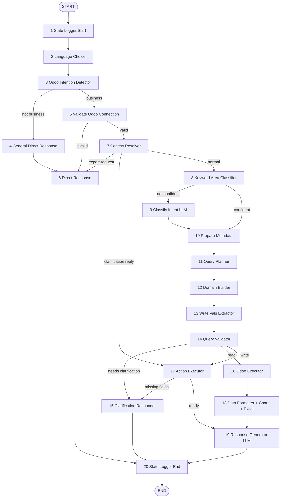

# ERP Workflow Automation — how real agents and scripts actually drive ERPs, step by step

Research date: 2026-08-11. Sources: four vendored repos under `research/external/repos/` —
`odoo-ai-agent` (martinpercu / "The Odoo Agent" frontend + public backend architecture doc),
and the Browser-Automation-Hub trio `sap-fiori-browser-automation`, `oracle-ebs-browser-automation`,
`sage-300-browser-automation`.

Purpose: finance-world's task walks are currently 3–10 tool hops. This note is the evidence base for
what a **10+ step** ERP walk actually looks like — the decomposition a shipping agent uses, the literal
UI step sequences a shipping automation encodes, and the friction both of them budget for.

All paths below are relative to `/Users/samuelchien/dev/finance-world/research/external/repos/`.
Everything is **reference for simulation only** — the browser repos are MIT
(`sap-fiori-browser-automation/LICENSE:1`), `odoo-ai-agent` ships **no LICENSE file** and its backend
source is explicitly private (`odoo-ai-agent/documents/BACKEND_ARCHITECTURE.md:17`), so both are
fact-sources, not code-sources.

---

## 0. Honesty ledger — what is shipped vs what is claimed

House rule applied: shipped data wins, both recorded.

| Claim (vendor README) | What the shipped source actually contains | Evidence |
|---|---|---|
| SAP Fiori: 5 "Supported Actions" incl. `extract_financial_data()`, `manage_invoices()` | **3 of 5 implemented** with real selectors; `extract_financial_data` and `manage_invoices` are stubs whose bodies are `// TODO: Replace with actual SAP Fiori selectors` returning `{ status: 'ok', data: null }` | `sap-fiori-browser-automation/README.md:46-52` (heading `:46`, five bullets `:48-52`) vs `src/actions.js:142-192` |
| Oracle EBS: 5 supported actions (`login_ebs`, `navigate_responsibility`, `submit_requisition`, `approve_po`, `run_concurrent_request`) | **0 of 5 implemented.** All five are the same TODO stub | `oracle-ebs-browser-automation/README.md:48-52` vs `src/actions.js:17-155` |
| Sage 300: 5 supported actions (`login_sage`, `create_journal_entry`, `process_ap_invoice`, `run_financial_report`, `update_inventory`) | **0 of 5 implemented.** All five are the same TODO stub | `sage-300-browser-automation/README.md:48-52` vs `src/actions.js:17-154` |
| "Known Selectors Reference — selectors observed in the web interface" | SAP has a real **21-row** selector table (4 login + 5 create-PO + 4 approve-workflow + 4 extract-financial + 4 manage-invoices); Oracle and Sage both say *"Selector reference not yet documented"* | `sap-fiori-browser-automation/README.md:257-283` (heading `:257`, header row `:261-262`, 21 data rows `:263-283`) vs `oracle-ebs-browser-automation/README.md:257-261`, `sage-300-browser-automation/README.md:257-261` |
| odoo-ai-agent "21-node LangGraph agent" | The published flow diagram names **20** nodes; the 21st is never named in any public file (backend repo is private) | `odoo-ai-agent/documents/BACKEND_ARCHITECTURE.md:28,100-146,388-407` |

**Net verified surface: 12 of 15 browser-automation "actions" are non-functional stubs that return
`{status:'ok', data:null}`.** That is itself the single most portable finding in this cluster (see §4,
"the lying tool"). The *step sequences* that are real live in SAP's three implemented functions plus
all three repos' shared auth/session/retry machinery, which is **structurally identical but not
byte-identical** across the three — every shared file differs, and only in branding/env-var strings
(re-verified by `diff` of SAP against Oracle and against Sage):

- `src/utils.js` — differs **only** in the header comment (`:2`). Code is identical.
- `src/session.js` — header comment (`:2`), plus `:59` `process.env.SAP_FIORI_URL` /
  `ORACLE_EBS_URL` / `SAGE_300_URL`.
- `src/custom-actions.js` — header comment (`:2`), plus `:40` (same three env vars).
- `src/auth.js` — four hunks: header comment + SSO/MFA flavor line (`:2-3`); `:17-19`
  BASE_URL **and** `*_USERNAME` / `*_PASSWORD` env-var names; `:133` the missing-credentials
  error string (`Set SAP_FIORI_USERNAME and SAP_FIORI_PASSWORD in .env`); `:136` the login
  log line (`Logging in to SAP Fiori...`).

---

## 1. odoo-ai-agent — a shipping agent's decomposition of ERP work

### 1.1 System shape

`Next.js frontend → POST /chat/{id}/stream (SSE) → FastAPI gateway → LangGraph 21-node StateGraph →
Odoo over XML-RPC`, with PostgreSQL as checkpointer/tenancy/pins/audit and ~2 LLM calls per turn
(`documents/BACKEND_ARCHITECTURE.md:25-39`).

Design philosophy, verbatim-sourced (`documents/BACKEND_ARCHITECTURE.md:45-47`):

- **keyword-first, LLM-last** — "Most nodes run pure Python heuristics in under 5ms. The LLM is only
  called **twice per turn maximum**: once for intent classification (when keywords aren't enough) and
  once for response generation."
- **computed facts** — "all numeric totals, averages and breakdowns are pre-calculated in Python by the
  Data Formatter node and handed to the LLM as exact values — the model is told to use them verbatim
  instead of doing its own arithmetic. This eliminates hallucinated math. When results are paginated,
  the executor fetches **global totals** (via `read_group`) so the LLM can distinguish page subtotals
  from the full dataset total."

That second bullet is the strongest single argument in this whole cluster for how finance-world should
grade numeric answers: the production system does not trust the model to add. Response LLM is
configurable: OpenAI `gpt-4.1-nano` (default), Google `gemini-2.5-flash-lite`, Anthropic
`claude-sonnet-4-5` (`:50-58`).

### 1.2 The node table

Reconstructed literally from the published flow graph (`documents/BACKEND_ARCHITECTURE.md:100-146`)
and the module layout (`:388-407`). Diamonds in the diagram are **conditional edges** (routes live in
`src/agents/odoo_agent/routes/`, `:403`), not nodes.

| # | Node (diagram label) | Folder (where published) | Kind | What it does / what it emits |
|---|---|---|---|---|
| 1 | State Logger Start | — | instrumentation | Opens the turn; feeds the Builder-only `trace` SSE stream (`:255`) |
| 2 | Language Choice | `nodes/language_choice/` | classifier | Picks response language (6 conversational languages, `:158`) |
| 3 | Odoo Intention Detector | `nodes/odoo_intention_detector/` | gate | "Business query?" — if No, bail to General Direct Response |
| 4 | General Direct Response | — | terminal responder | Non-ERP small talk; skips the whole ERP pipeline |
| 5 | Validate Odoo Connection | — | precondition | Connection/credential check; invalid → Direct Response |
| 6 | Direct Response | — | terminal responder | Also the landing pad for export requests routed out of Context Resolver |
| 7 | Context Resolver | `nodes/context_resolver/` | 3-way router + memory | Resolves follow-ups / sticky context; routes **export request → Direct Response**, **clarification reply → Action Executor**, **normal → Keyword Area Classifier** |
| 8 | Keyword Area Classifier | `nodes/keyword_area_classifier/` | cheap classifier | Deterministic area classification; "Confident?" gate decides whether the LLM is needed at all |
| 9 | Classify Intent — LLM | `nodes/classify_intent/` | **LLM call #1** | Only reached when keywords are not confident |
| 10 | Prepare Metadata | — | enrichment | Assembles model/field metadata for planning |
| 11 | Query Planner | `nodes/query_planner/` | planner | Decides query type (count / aggregation / top-N / listing / detail / exists / create / update / method / report) |
| 12 | Domain Builder | `nodes/domain_builder/` | translator | Builds the Odoo `domain` (the ORM filter AST) — state field `dynamic_domain` |
| 13 | Write Vals Extractor | `nodes/write_vals_extractor/` | extractor | Regex-first extraction of write values; LLM fallback for hard cases (`:171`) — state field `write_vals` |
| 14 | Query Validator | `nodes/query_validator/` | **validation + 3-way router** | "Needs clarification?" → Clarification Responder; else Read → Odoo Executor, Write → Action Executor |
| 15 | Clarification Responder | — | terminal responder | Emits the clarifying question; also the landing pad for Action Executor's "missing fields" path |
| 16 | Odoo Executor | `nodes/odoo_executor/` | read tool-caller | `search_count` / `search_read` / `read_group` over XML-RPC; fetches **global totals** when paginated |
| 17 | Action Executor | `nodes/odoo_action_executor/` | write tool-caller + gate | `create` / `write` / method call / report; emits `action_proposal` and waits for human confirm; "missing fields" → Clarification Responder |
| 18 | Data Formatter (+ Charts + Excel) | `nodes/data_formatter/` | computation | Pre-computes every total/average/breakdown; builds chart payload + `.xlsx` |
| 19 | Response Generator — LLM | `nodes/response_generator/` | **LLM call #2** | Drafts prose from computed facts |
| 20 | State Logger End | — | instrumentation | Closes the turn; last `trace` entry is `stream:end` (`:255`) |
| 21 | **unnamed** | — | — | **UNVERIFIED** — the doc asserts 21 nodes twice (`:28` `21-node StateGraph`; `:394` `odoo_agent.py # StateGraph builder (21 nodes)`) but names only 20; folder list is elided with "…" (`:402`) |

### 1.3 The graph, as edges



Structural facts worth stealing:

1. **Four routers, three of which can end the turn early.** Intention (is this even ERP?), Connection
   (can I reach the system?), Confidence (do I need the LLM?), Clarification/Read/Write (a *three*-way
   split, not two). A realistic ERP walk is not a straight line — it has an early-exit at every
   precondition.
2. **The write path is structurally different from the read path.** Reads go Executor → Formatter →
   Responder. Writes go Executor → (missing fields → Clarification) → Responder, and never touch the
   Data Formatter. Read and write are *not* symmetric tool calls.
3. **Clarification is a first-class node with two in-edges** (from Query Validator, and from Action
   Executor's missing-field path), and its reply re-enters the graph at Context Resolver → Action
   Executor. Clarification is a **loop**, not a leaf.
4. **Validation precedes execution, always.** `Query Validator` sits between planning and every tool
   call. Nothing reaches Odoo unvalidated.
5. **The expensive model is called last and only on pre-computed facts.**

### 1.4 The state object

`OdooState` (a TypedDict, "single source of truth", `documents/BACKEND_ARCHITECTURE.md:395`) lives in the
private backend — but the feedback-report payload is documented as a "full conversation + **LangGraph
state snapshot**" (`:188`), and the frontend types that payload field-by-field in
`odoo-ai-agent/lib/types.ts:805-866`. That gives a verified reconstruction:

| Group | Fields (as shipped in `lib/types.ts`) |
|---|---|
| Conversation | `last_messages[{role: human\|ai, content, id}]`, `user_query`, `agent_response`, `thread_id` |
| Classification | `language`, `primary_model`, `classified_areas[]`, `query_type`, `keyword_classification_done`, `needs_llm_classification`, `keyword_hints[]` |
| Domain / plan | `dynamic_domain[]`, `date_filter{}`, `entity_filter{}` |
| Execution | `odoo_total_count`, `odoo_was_truncated`, `is_followup_query`, `formatted_for_llm`, `odoo_raw_data[]` |
| Errors | `odoo_error`, `write_error` |
| Write branch | `is_write_operation`, `write_vals{}`, `pending_action{}` |
| Clarification branch | `needs_clarification`, `clarification_question` |

Two of these are directly worth porting into finance-world's tool-result envelopes:
`odoo_total_count` + `odoo_was_truncated` (a paginated read that *tells you* it was truncated, and a
separate global total so a page subtotal can never be mistaken for the answer).

### 1.5 The tool surface the nodes call

Read tools (`documents/BACKEND_ARCHITECTURE.md:211-224`) — note the query-type → ORM-method table is
explicit, which is exactly the granularity a mock should copy:

| Query type | Example | Odoo method |
|---|---|---|
| Count | "How many open invoices?" | `search_count` |
| Aggregation | "Total revenue by customer" | `read_group` (+ chart + Excel) |
| Top N | "Top 5 invoices by amount" | `search_read` (ordered, limited) |
| Listing | "Show overdue invoices" | `search_read` |
| Detail | "Invoice INV-001" | `search_read` by id/name |
| Exists | "Does client X have debt?" | `search_count > 0` |
| Create | "Create a contact named Pepe" | `create` (confirmation gate) |
| Update | "Change Pepe's email" | `write` (confirmation gate) |
| Method call | "Confirm order SO001" | `action_confirm` / `action_cancel` / … |
| Report | "Download the invoice PDF" | `ir.actions.report` → PDF |

Models in scope — the "Supported Odoo Areas" table verbatim, six areas, one row each
(`:226-235`): Sales `sale.order`, `sale.order.line`, `crm.lead` (`:230`); Finance `account.move`,
`account.payment`, `account.bank.statement` (`:231`); **Inventory** `stock.picking`,
`product.product`, `product.template`, `purchase.order`, `purchase.order.line` (`:232` — note the
doc files purchasing models under Inventory, and includes the two product models); Contacts
`res.partner` (`:233`); HR `hr.employee` (`:234`); Projects `project.project`, `project.task`,
`account.analytic.line` (`:235`).

Relational-field → model resolution map (entity resolution, shipped client-side in
`odoo-ai-agent/components/chat/action-proposal-button.tsx:33-52` — 18 entries at `:33-50`,
fallback at `:52`): `partner_id→res.partner`,
`product_id→product.product`, `account_id→account.account`, `journal_id→account.journal`,
`payment_term_id→account.payment.term`, `analytic_account_id→account.analytic.account`,
`currency_id→res.currency`, `tax_id→account.tax`, plus a fallback rule
(`strip _id, replace _ with .`). Field **type** is inferred from the key name — `_id`→entity picker,
`date`/`fecha`→date, `amount|price|total|qty|quantity`→number (`:20-27`). A mock ERP that names its
fields this way gets free realism.

Confirmed **write** coverage per domain, from the shipped implementer manual
(`odoo-ai-agent/messages/en.json:1292-1337` — the `coverage` block: `sales` `:1300-1308`,
`finance` `:1309-1314`, `inventory` `:1315-1321`, `contacts` `:1322-1327`, `hr` `:1328-1331`,
`projects` `:1332-1337`; the five rows below merge HR and Projects) — note this is a candid
capability/limit map, rare in vendor material:

| Domain | Reads | Confirmed writes | Stated limit |
|---|---|---|---|
| Finance | invoice/credit-note status filters (overdue, paid, partial, receivable, payable); **receivables ageing in 30/60/90+ buckets computed in Python, not from Enterprise modules**; any result to PDF/Excel with totals row | invoices: create + edit; existing invoices: validate, cancel, send by email | — |
| Inventory / Purchasing | catalogue + stock on hand; PO, PO lines, transfers | **catalogue products: create + edit** (`:1318`); existing POs and transfers: confirm, cancel, validate, send (`:1319`) | **"Creating a brand-new purchase order from scratch over chat is not available yet."** (`:1320`) |
| Sales / CRM | counts, rankings, aggregations by salesperson/team/category/month; win rate and probability-weighted pipeline **computed in backend, never by the LLM** | SO create/edit/confirm/cancel/send; opportunity stage moves, won/lost with reason, assign salesperson; lead→opportunity; schedule call/meeting | can't create an opportunity from scratch |
| Contacts | distinguishes customers/vendors/companies/individuals; accent- and case-tolerant name search; offers a type filter before dumping the address book | create + edit; auto-classification resolved "with a short question when needed" | — |
| HR / Projects | employees, payslips + lines; projects, tasks, timesheets | tasks: workflow actions only | can't create projects/tasks |

Governing rule (`messages/en.json:1295`): **"Every write operation, in every domain, goes through an
explicit human confirmation before it runs against Odoo."**

### 1.6 The confirmation gate, wire-level

This is the most portable artifact in the repo — a fully typed human-in-the-loop write protocol
(`odoo-ai-agent/lib/types.ts:29-62`, README examples at `odoo-ai-agent/README.md:753-885`):

```json
{ "type": "action_proposal",
  "action": { "action": "create|update|method_call|report|report_combined",
              "model": "account.move", "vals": {...}, "target_ids": [] | null,
              "method": null, "canonical_verb": null, "status": "pending_confirmation" },
  "labels": { "action_btn": "...", "confirm_btn": "...", "cancel_btn": "...",
              "cancelled_msg": "...", "values": [{label, value}] } }
```

Confirm → `POST /chat/{id}/action` with `{config_id, action, context, language}` → typed result union
(`lib/types.ts:202-208`) and status codes (`README.md:929-983`): **400** validation, **401** Odoo auth
failed, **402** payment/limit reached, **422** Odoo *business* error (constraint violation, per-field
errors), **500** execution error. Responses may carry `queue_next: {text}` to **auto-sequence** the
next action (multi-intent chains like "create a contact, then a quote, then confirm it",
`documents/BACKEND_ARCHITECTURE.md:173`).

Ambiguity protocol (`selection_prompt`, `lib/types.ts:64-188`): the base variant is entity
disambiguation — `{field: "partner_id", searchValue: "Juan", options: [{index, id, name}]}` — plus nine
`kind`-tagged variants: `report_type`, `partner_filter`, `salesperson_type`, `contact_type`,
`person_disambiguation` (with a `tooMany` flag), `person_role`, `report_offer`, `agg_report`
(with `reason: "too_many" | "explicit"`), `stage_drilldown`. A production ERP agent needs **ten**
distinct shapes of "I need you to disambiguate."

### 1.7 Endpoints and background machinery

`odoo-ai-agent/README.md:688-751` lists **64** consumed endpoints (the "Consumed endpoints" table:
intro `:684`, header `:686-687`, 64 data rows `:688-751`; re-derived with
`grep -cE '^\| \`?(GET|POST|PUT|PATCH|DELETE)' README.md`). The ones that matter for task design:
`POST /chat/{id}/stream` (SSE), `POST /chat/{id}/action` (confirm), `POST /chat/{id}/upload`
(invoice/receipt image → OCR → `action_proposal`), `GET /chat/{id}/audit` (action execution history),
`POST /chat/{id}/search` (`name_search` for entity autocomplete), `POST /test-connection` →
`{ok, company_name, odoo_version}` or `{ok:false, error_code: "unreachable"|"db_not_found"|"auth_failed"}`
(`lib/types.ts:605-609`), pins CRUD + `POST /chat/{id}/pin/{pinId}/refresh`.

SSE event types (`documents/BACKEND_ARCHITECTURE.md:239-256`): `text`, `action_proposal`,
`selection_prompt`, `chart`, `export`, `pin_suggestion`, `pinned_ids`, `notifications`, `watermark`,
`error`, `trace`. The `error` event is the interesting one: **HTTP stays 200 — the failure travels
inside the stream** (`:254`, elaborated `README.md:881`), already localized and neutral, terminal,
with any partial text kept and `⚠️ {detail}` appended.

OCR pipeline (`:341-369`) — heuristic-first, LLM-last, with per-field confidences: Tax ID
(CUIT/RUC/RFC/NIF/VAT) country regex 0.95; total/subtotal/tax via keyword + nearest monetary value
with a `subtotal + tax ≈ total` check 0.85–0.90; invoice/due date (DD/MM/YYYY priority) 0.75–0.80;
currency ISO > symbol > taxID country > instance default 0.60–0.80; invoice reference 0.85; vendor name
0.60. **Total and invoice date are the two mandatory fields**; if the heuristic misses either, raw OCR
goes to a small LLM. Tax ID hit → search `res.partner` by `vat` → include `partner_id`, else
`partner_not_found: true`.

Proactive monitoring (`:373-384`): a background leader-elected (Postgres advisory lock) scan every
15 min, business hours only (default 06:00–23:00), comparing today vs a 7-day moving average —
`sales_drop` <70%, `sales_spike` >150%, `overdue_invoices` count spike, `new_leads_drop` <50%;
severities `info|warning|critical`; frontend polls every 30s
(`odoo-ai-agent/hooks/use-notifications.tsx:13,45` — `POLL_INTERVAL = 30_000`, `limit: 50`).

Testing posture worth copying wholesale (`:61-94`): 2,000+ unit/characterization tests in CI; 180+
end-to-end scenarios judged by an **LLM-as-judge with chain-of-thought + state/node-path assertions +
latency**; and a feedback→regression loop where a user's "report problem" click captures the state
snapshot of §1.4 and auto-converts it into a replayable regression scenario. One deliberate rule
(`:94`): whether a scenario is single- or multi-turn is decided **objectively by counting turns**,
never by asking the agent — "If the bug *is* that the agent failed to recognize context, trusting its
own judgment on that would hide the very failure being reproduced." That is a directly transferable
grading principle.

---

## 2. The browser-automation cluster — literal UI step sequences

### 2.1 Action inventory across the three ERPs

| System | Function | Claimed step | Shipped? | Evidence |
|---|---|---|---|---|
| SAP Fiori | `login_fiori(page, opts)` | Authenticate to Fiori Launchpad with SSO | ✅ real | `sap-fiori-browser-automation/src/actions.js:17-47` |
| SAP Fiori | `create_purchase_order(page, opts)` | Create + submit POs | ✅ real (navigate + supplier only) | `src/actions.js:55-94` |
| SAP Fiori | `approve_workflow(page, opts)` | Bulk-approve pending workflow items | ✅ real (approves first item) | `src/actions.js:102-134` |
| SAP Fiori | `extract_financial_data(page, opts)` | Download financial reports + GL entries | ❌ stub | `src/actions.js:142-163` |
| SAP Fiori | `manage_invoices(page, opts)` | Process and match vendor invoices | ❌ stub | `src/actions.js:171-192` |
| Oracle EBS | `login_ebs` | SSO/LDAP login | ❌ stub | `oracle-ebs-browser-automation/src/actions.js:17-38` |
| Oracle EBS | `navigate_responsibility` | Switch between EBS responsibilities/roles | ❌ stub | `src/actions.js:46-67` |
| Oracle EBS | `submit_requisition` | Create purchase requisitions via self-service | ❌ stub | `src/actions.js:75-96` |
| Oracle EBS | `approve_po` | Approve POs in the notification queue | ❌ stub | `src/actions.js:104-125` |
| Oracle EBS | `run_concurrent_request` | Submit and monitor concurrent program requests | ❌ stub | `src/actions.js:133-154` |
| Sage 300 | `login_sage` | Authenticate to Sage 300 web portal | ❌ stub | `sage-300-browser-automation/src/actions.js:17-38` |
| Sage 300 | `create_journal_entry` | Post journal entries to the GL | ❌ stub | `src/actions.js:46-67` |
| Sage 300 | `process_ap_invoice` | Enter and post AP invoices | ❌ stub | `src/actions.js:75-96` |
| Sage 300 | `run_financial_report` | Generate and export financial statements | ❌ stub | `src/actions.js:104-125` |
| Sage 300 | `update_inventory` | Update inventory quantities and costs | ❌ stub | `src/actions.js:133-154` |

Even as stubs, the **names and their one-line descriptions** are the useful artifact: they are a
vendor's list of the five things people most want automated per ERP. Note the shape of the list —
each ERP gets *login + one navigation/context primitive + two transactional actions + one
extract/report action*. That's a good template for a mock ERP's tool budget.

### 2.2 SAP Fiori `login_fiori` — the 9-step literal sequence

`sap-fiori-browser-automation/src/actions.js:22-46`, wrapped in `retry(..., {attempts:3, delay:2000})`:

| # | Step | Literal call |
|---|---|---|
| 1 | Human-like pre-delay | `humanDelay(500, 1500)` |
| 2 | Navigate; **expect redirect to SAP IAS or Azure AD** | `page.goto(BASE_URL, {waitUntil:'networkidle2'})` — comment: `// Redirects to SAP IAS or Azure AD` |
| 3 | Wait for IdP username field, **20s** | `waitForSelector('input[name="loginfmt"], input[id*="username"], input[type="email"]', {timeout:20000})` |
| 4 | Type username char-by-char with 20–100ms jitter | `humanType(...)` (`src/auth.js:305-312`) |
| 5 | Submit | `click('input[type="submit"], button[type="submit"]')` |
| 6 | Wait for password field, **15s** (two-page IdP flow) | `waitForSelector('input[type="password"]', {timeout:15000})` |
| 7 | Type password, submit | |
| 8 | **Conditional MFA**: probe for OTP box; if present, generate TOTP and submit | `page.$('input[name="otc"], #idTxtBx_SAOTCC_OTC')` → `generateTOTP(process.env.MFA_SECRET)` |
| 9 | Wait for the Fiori shell header, **30s** | `waitForSelector('.sapUshellShellHead, #shell-header', {timeout:30000})` → `{status:'logged_in'}` |
| E | On any throw: screenshot `error-login_fiori-<ts>.png`, rethrow into the retry | `src/actions.js:42-45` |

Nine steps, three different timeouts, one conditional branch, one artifact-on-failure — **before any
business work happens at all.** finance-world's walks currently start at step 10.

### 2.3 SAP Fiori `create_purchase_order` — the launchpad-search pattern

`src/actions.js:60-93`. Target app: **"Manage Purchase Orders"**.

| # | Step | Literal call / selector |
|---|---|---|
| 1 | Delay | `humanDelay(500,1500)` |
| 2 | Wait for launchpad tiles, 20s | `waitForSelector('.sapUshellTile, .sapUshellContainerCell', {timeout:20000})` |
| 3 | Find the launchpad search box | `page.$('#sf, .sapMSF input, [placeholder*="Search"]')` |
| 4 | Type the app name into search | `keyboard.type('Manage Purchase Orders')` |
| 5 | Wait for a filtered tile, 10s — **failure tolerated** | `waitForSelector('.sapUshellContainerCell[title*="Purchase"]').catch(()=>{})` |
| 6 | Re-find the tile by **text content**, not selector | `evaluateHandle(name => Array.from(document.querySelectorAll('.sapUshellTileContainerContent, .sapUshellTile')).find(el => el.textContent.includes(name)))` |
| 7 | Click tile, else throw `SAP Fiori app tile not found: <name>` | |
| 8 | Wait for the supplier input, 20s | `waitForSelector('[id*="Supplier-inner"], [id*="supplier-input"]')` |
| 9 | Type supplier, wait for the value-help list, click first suggestion | `type('[id*="Supplier-inner"]', opts.supplier)` → `waitForSelector('.sapMLIB', {timeout:5000})` → `click('.sapMLIB:first-child')` |
| 10 | Return `{status:'navigated', screen:'create_po'}` — **it never actually creates a PO** | `:88` |

Two things to steal. First, the **search-the-launchpad-then-click-the-tile-by-label** pattern is the
canonical "find the app" hop in any tiled ERP UI — a mock can reproduce it as a `find_app(name)` tool
that can miss. Second, step 9 is **entity resolution by typeahead**: type a partial supplier, wait for
suggestions, take the first — the exact place where a wrong-vendor error is born, and the browser
analogue of odoo-ai-agent's `selection_prompt`. Third: the honest return value. The function's name
promises a PO; it delivers a navigation. Vendor-claimed capability ≠ delivered capability.

### 2.4 SAP Fiori `approve_workflow` — the inbox loop

`src/actions.js:107-133`:

| # | Step | Literal call / selector |
|---|---|---|
| 1 | Wait for the **My Inbox** tile, 20s | `waitForSelector('.sapUshellTile[title*="My Inbox"], [title*="Notifications"]')` |
| 2 | Open My Inbox | `click('.sapUshellTile[title*="My Inbox"]')` |
| 3 | Wait for the task list, 15s | `waitForSelector('.sapMList .sapMListItem, .sapMFlexBox .sapMLIBContent')` |
| 4 | **Scrape the whole worklist** into `{title, description}` per row | `evaluate(...querySelectorAll('.sapMSLITitle, .title' / '.sapMSLIDescription, .description'))` |
| 5 | Open the first task | `click('.sapMList .sapMListItem:first-child')` |
| 6 | Wait for the Approve button, 10s | `waitForSelector('button[id*="Approve"], button[title*="Approve"]')` |
| 7 | Click Approve | |
| 8 | Wait for the **confirm dialog**, 10s — tolerated failure | `waitForSelector('.sapMDialogScrollCont, [id*="Accept"]').catch(()=>{})` |
| 9 | Click OK in the dialog if present | `page.$('.sapMDialogScrollCont button[id*="OK"], [id*="Accept"]')` |
| 10 | Return `{status:'ok', tasksFound: tasks.length}` | |

Despite the README's "Approve pending workflow items **in bulk**"
(`sap-fiori-browser-automation/README.md:50`), the shipped code approves **exactly one** item — the
first. Bulk is claimed, single is shipped. Also note the two-step commit: click Approve, *then* clear a
modal confirmation. That double-confirm is the browser-world twin of odoo-ai-agent's
`action_proposal → pending_confirmation → POST /action`.

### 2.5 SAP Fiori selector table (the only real one in the cluster)

`sap-fiori-browser-automation/README.md:257-283` "Known Selectors Reference" — **21 rows**
(`:263-283`; 4 login + 5 create-PO + 4 approve-workflow + 4 extract-financial + 4 manage-invoices).
Load-bearing subset for finance workflows:

| Workflow | Element | Selector |
|---|---|---|
| login | username / password / submit / MFA code | `input[name="loginfmt"]` / `input[type="password"]` / `input[type="submit"]` / `input[name="otc"]` |
| create PO | launchpad search / app tile / supplier / material / save | `#sf` / `.sapUshellTile` / `input[id*="Supplier-inner"]` / `input[id*="Material-inner"]` / `button[title="Save"]` |
| approve workflow | My Inbox tile / task list / approve btn / confirm dialog | `.sapUshellTile[title*="My Inbox"]` / `.sapMList .sapMListItem` / `button[id*="Approve"]` / `.sapMDialogScrollCont button[id*="OK"]` |
| extract financial data | report app / date-from / date-to / export Excel | `[title*="Financial"]` / `input[id*="DateFrom-inner"]` / `input[id*="DateTo-inner"]` / `button[title*="Export"]` |
| manage invoices | invoice app / invoice list / **match btn** / **post btn** | `[title*="Invoice"]` / `.sapMList .sapMListItem` / `button[title*="Match"]` / `button[title*="Post"]` |

The last two rows are the AP three-way-match UI reduced to its essentials: **list → select → Match →
Post**, i.e. matching and posting are two separate irreversible clicks. And the financial-extract row
gives the canonical report-run shape: **pick app → set date-from → set date-to → Export**. Both are
stub-only in code but the selectors are documented as observed.

The table carries its own decay warning (`README.md`, above the table): *"Enterprise applications
update their UIs — verify against your specific instance and submit PRs when selectors break"*, plus
`> ⚠️ Selectors are best-effort. Run node src/utils.js --verify-selectors` — a flag that **does not
exist** in `src/utils.js` (exports are `retry, humanDelay, log, waitForNetworkIdle, safeEvaluate` +
4 error classes, `src/utils.js:101-111`). Documented affordance, absent implementation.

### 2.6 The ActionBuilder DSL — a generic ERP step vocabulary

`sap-fiori-browser-automation/src/custom-actions.js` (identical in all three repos apart from the
header comment at `:2` and the `*_URL` env var at `:40`). A fluent, queued
step language: `.login()`, `.navigate(url)`, `.waitForSelector(sel, {timeout=15000})`, `.click(sel)`,
`.type(sel, text)`, `.extractTable(sel)`, `.extractText(sel)`, `.screenshot(name)`,
`.waitDelay(min,max)`, `.do(fn)`, `.run(page)`.

Two details matter. `.extractTable` does the header/row zip that every ERP grid scrape does
(`:84-92`: read `th` for headers, `tr` slice(1) for rows, `Object.fromEntries`). And `.run()` retries
**every step independently** at `{attempts: 2, delay: 1500}` (`:143`) — including `.click()` steps. See
§4.

---

## 3. Cross-cutting auth & session machinery (identical across all three ERPs)

`src/auth.js` + `src/session.js`, structurally identical across the three repos and differing only in
the branding/env-var strings enumerated in §0 (header comment, SSO/MFA flavor line, `*_URL` /
`*_USERNAME` / `*_PASSWORD` defaults, and two user-facing strings in `auth.js:133,136`):

| Concern | SAP Fiori | Oracle EBS | Sage 300 |
|---|---|---|---|
| Default base URL | `https://your-instance.s4hana.cloud.sap/sap/bc/ui2/flp` | `https://your-ebs.example.com/OA_HTML/AppsLogin` | `https://your-sage300.example.com/sage300/webapi/v1` |
| SSO flavor | SAP IAS / Azure AD | Oracle SSO / LDAP / OAM | Active Directory / LDAP |
| MFA flavor | SAP Authenticator / TOTP | Oracle MFA / RSA | Sage MFA / Email OTP |
| Evidence | `sap-.../src/auth.js:3,17`; README:175-193 | `oracle-.../src/auth.js:3,17`; README:175-193 | `sage-.../src/auth.js:3,17`; README:175-193 |

Shared behaviors (all from `src/auth.js` / `src/session.js`):

- **Session-first**: `createSession()` tries `loadSession()`, navigates, calls `checkLoggedIn()`, and
  only logs in fresh if that fails (`auth.js:105-119`).
- `checkLoggedIn()` is a **URL heuristic** — "not logged in" iff the URL contains `login`/`signin`/`auth`
  (`auth.js:121-129`). Cheap, and wrong in exactly the interesting cases.
- **Session TTL 8 hours**, configurable via `SESSION_MAX_AGE_HOURS`; expiry deletes `session.json` and
  forces re-auth (`session.js:11,47-51`, `.env.example`).
- **SSO detection is also a URL heuristic**: `sso|saml|okta|azure` in the URL → `handleSSOLogin()`
  (`auth.js:140-145`); MFA detection is also a URL heuristic but the **two call sites use different
  token sets**: `performLogin` tests `mfa|verify|challenge|totp` (`auth.js:159`), while
  `handleSSOLogin` tests `mfa|verify|duo|challenge` (`auth.js:185`) — `totp` is only checked on the
  direct path, `duo` only on the SSO path.
- **Three MFA modes** (`auth.js:190-226`): `totp` (RFC-6238, `otpauth` with an inline HMAC-SHA1
  fallback, `auth.js:26-58`), `duo_push` (**blocks up to 60s waiting for a phone tap**), `sms`
  (blocks on stdin for a human to paste the code).
- **Okta-style two-page login** handled explicitly: if no password field, click Next
  (`[data-se="o-form-button-bar"] input`) and wait 15s for the password field (`auth.js:171-176`).
- **Anti-bot posture**: `--disable-blink-features=AutomationControlled`, `--disable-infobars`, pinned
  Chrome-120 UA, 1280×800 viewport (`auth.js:89-103`); cloud path uses residential US proxies
  (`auth.js:250`).
- Cloud path (`withAnchorBrowser`, `auth.js:238-275`): `POST /v1/sessions` → CDP URL → `puppeteer.connect`
  → run → `DELETE /v1/sessions/{id}` in `finally`. Header auth `anchor-api-key`. A tidy model for a
  mocked "remote browser session" resource with explicit create/teardown.

---

## 4. Friction and failure handling — sourced rates and behaviors

Everything in this table is read off shipped code, not vendor prose. This is the friction budget
finance-world can defend.

| Friction | Exact shipped behavior | Evidence | Portable as |
|---|---|---|---|
| Retry policy | `retry(fn, {attempts=3, delay=1000, backoff=1.5})` — waits `delay * 1.5^i`; every action calls it as `{attempts:3, delay:2000}` → **2s, 3s** between tries, 3 tries total | `sap-.../src/utils.js:12-28`; `actions.js:46,93,133,162,191` | transient tool failure with p(fail) tuned so ~3 tries usually wins |
| Retry granularity in the DSL | `ActionBuilder.run()` retries **each step** at `{attempts:2, delay:1500}` — including `.click()` | `src/custom-actions.js:143` | **duplicate-submit hazard**: a retried click on an already-posted document |
| Whole-workflow retry over writes | `create_purchase_order` and `approve_workflow` are *entirely inside* `retry()` — a failure after the Approve click re-runs the approve | `src/actions.js:60-93,107-133` | duplicate approval / double-post chaos |
| Timeout ladder | 5s (value-help list) · 10s (approve btn, confirm dialog) · 15s (password, task list, generic content) · 20s (username, tiles, supplier field) · 30s (post-login shell, navigation) · 60s (Duo push) | `actions.js:27,30,64,70,82,85,110,112,122,124,40`; `auth.js:154,196` | per-tool latency distribution, longest waits on auth and post-navigation |
| Tolerated failures | Three `waitForSelector(...).catch(()=>{})` — the filtered tile, the value-help list, the confirm dialog — the workflow proceeds anyway | `actions.js:70,85,124` | optional popups: sometimes present, and the agent must not hang on them |
| Failure artifacts | Every action screenshots `error-<action>-<ts>.png` before rethrowing; `basic-login.js` screenshots `error-<ts>.png` at top level | `actions.js:43,90,130,159,188`; `examples/basic-login.js:44-46` | tool errors that produce an inspectable artifact |
| Typed errors | `AuthenticationError`, `SelectorNotFoundError(selector)`, `SessionExpiredError` ("Session expired — re-authentication required"), `RateLimitError` ("Rate limit detected — adding delay before retry") | `src/utils.js:53-80` | four-way error taxonomy for a mock ERP tool |
| **Defined but never thrown** | None of the four error classes is constructed anywhere in `actions.js`/`auth.js`/`session.js`; raw `Error` is thrown instead (`actions.js:80`, `auth.js:133,214,240,307`) | grep across `src/` | the classic "error taxonomy exists in docs, generic errors in practice" |
| Session expiry mid-run | 8h TTL; on expiry the file is deleted and login re-runs from scratch | `session.js:11,47-51` | long walks that hit a re-auth wall partway |
| Human-delay jitter | `humanDelay(min,max)` uniform random; typing is per-character `delay: rand*80+20` ms (auth) / `rand*60+20` ms (builder) | `utils.js:33-36`; `auth.js:310`; `custom-actions.js:74` | non-deterministic latency; a 20-char field ≈ 0.4–2.0s to fill |
| Blocking human dependency | `duo_push` blocks 60s for a phone tap; `sms` blocks on stdin forever | `auth.js:193-209` | a tool that requires an out-of-band human and can time out |
| Silent-success stubs | 12 of 15 actions return `{status:'ok', data:null}` with no side effect | §2.1 table | **the lying tool** (see below) |
| Streamed error inside HTTP 200 | odoo-ai-agent's `error` SSE event: status stays 200, failure travels in-stream, terminal, partial text preserved | `odoo-ai-agent/documents/BACKEND_ARCHITECTURE.md:254`; `README.md:881` | success-shaped envelope containing a failure |
| Read truncation | `odoo_total_count` + `odoo_was_truncated` in state; executor separately fetches global totals via `read_group` so page subtotal ≠ dataset total | `odoo-ai-agent/lib/types.ts:846-847`; `documents/BACKEND_ARCHITECTURE.md:47` | paginated reads where the naive sum is wrong |
| Read cache staleness | 45s in-memory TTL on Odoo reads, auto-invalidated on writes | `documents/BACKEND_ARCHITECTURE.md:189` | read-after-write staleness window |
| Dashboard staleness | Pinned insights are point-in-time until an explicit `POST /pin/{id}/refresh` returns `refreshed_at` | `documents/BACKEND_ARCHITECTURE.md:330-338`; `README.md:911-928` | stale-dashboard-vs-live-ERP chaos, now sourced |
| Polling cadence | Notifications polled every 30s, `limit: 50`; backend monitor scans every 15 min, business hours only | `odoo-ai-agent/hooks/use-notifications.tsx:13,45`; `documents/BACKEND_ARCHITECTURE.md:384` | alerting lag |
| Auth error taxonomy (API side) | `test-connection` → `error_code: "unreachable" \| "db_not_found" \| "auth_failed"`; per-user credential status `unset \| active \| invalid`, flipped to `invalid` when a query fails on auth | `odoo-ai-agent/lib/types.ts:605-609,441-447` | credential lifecycle as a task obstacle |
| Business-vs-validation errors | 400 validation / 401 auth / 402 limit / 422 **Odoo business error with per-field errors** / 500 execution | `odoo-ai-agent/README.md:969-975` | distinguishing "you asked wrong" from "the ERP said no" |

**The lying tool.** The single most valuable chaos primitive here: 12 of 15 shipped ERP actions return
`{ status: 'ok', data: null }` — a success envelope with no work done and no data. An agent that checks
`status === 'ok'` and moves on is wrong; an agent that notices `data: null` contradicts the requested
report is right. finance-world already models stale/divergent data; it does not yet model a tool that
**reports success while doing nothing**. This is real, shipped, and citable.

---

## 5. Mapping onto finance-world's 15 task families

Existing families: `bank_rec`, `business_brief`, `cash_app`, `cash_forecast`, `close_mgmt`,
`collections_ops`, `cross_system`, `erp_qa`, `erp_qa_fb`, `expense_audit`, `finance_qa`,
`payment_proposal`, `pbc`, `threeway_match`, `vendor_master`. Prior mapping work:
`research/workflow-mock-mapping.md`, `research/domain-workflows.md`.

| Extracted workflow | Source evidence | Nearest existing family | Verdict |
|---|---|---|---|
| Aged receivables in 30/60/90+ buckets, computed in Python not by the LLM | `odoo-ai-agent/messages/en.json:1311` | `collections_ops`, `erp_qa` | **Covered.** Confirms our aging-bucket design and the compute-in-code rule |
| Invoice status filters (overdue/paid/partial/receivable/payable) | `messages/en.json:1311` | `erp_qa`, `finance_qa` | Covered |
| Export any result to PDF/Excel with a totals row | `messages/en.json:1311`; `documents/BACKEND_ARCHITECTURE.md:316-327` | `pbc` (evidence packs) | Covered; the "totals row" convention is a free realism detail |
| SAP financial-report extract: pick app → date-from → date-to → Export | `sap-.../README.md` selector table | `finance_qa`, `cross_system` | Covered as a read; the **date-range-parameterised report run** is a missing hop shape |
| SAP `manage_invoices`: list → select → **Match** → **Post** | `sap-.../README.md` selector table | `threeway_match` | Covered on the match side; **Post is a write we don't model** |
| Vendor/supplier typeahead resolution (type partial → pick suggestion) | `sap-.../src/actions.js:83-87`; `odoo-ai-agent/lib/types.ts:64-77` | `vendor_master` | Partially covered — we don't model *picking the wrong suggestion* |
| Month-end report generation + export | `sage-.../README.md:51` (`run_financial_report`) | `close_mgmt` | Covered |
| **Approval-inbox work**: open My Inbox → scrape worklist → open item → Approve → clear confirm dialog | `sap-.../src/actions.js:107-133`; `oracle-.../README.md:51` (`approve_po`) | — | **GAP → `approval_queue`** |
| **Requisition intake** (self-service requisition → PO) | `oracle-.../README.md:50` (`submit_requisition`) | `threeway_match` starts at the PO | **GAP → `req_to_po`** |
| **PO creation from scratch** | `sap-.../src/actions.js:55-94`; and Odoo explicitly *cannot* do it (`messages/en.json:1320`) | `threeway_match` (read-only) | **GAP → `po_create`**; note both shipped systems stop short here — a well-sourced hard case |
| **Journal entry authoring + posting** | `sage-.../README.md:49` (`create_journal_entry`) | `close_mgmt` covers the checklist, not JE authoring | **GAP → `journal_entry`** |
| **AP invoice entry (create the record)** | `sage-.../README.md:50` (`process_ap_invoice`); Odoo "invoices: create and edit" (`messages/en.json:1312`) | `threeway_match`, `erp_qa` are read-side | **GAP → `ap_invoice_entry`** |
| **Batch/concurrent job**: submit → monitor → retrieve output | `oracle-.../README.md:52` (`run_concurrent_request`) | — | **GAP → `batch_job_ops`** (also the honest model for our aging-snapshot refresh) |
| **Responsibility / role switching** (EBS responsibilities) | `oracle-.../README.md:49` (`navigate_responsibility`) | `cross_system` is about systems, not roles | **GAP → `role_context`** — segregation-of-duties, "you're in the wrong responsibility" |
| **Write with a confirmation gate** (propose → human confirm → execute → audit) | `odoo-ai-agent/messages/en.json:1295`; `lib/types.ts:29-62`; `README.md:929-983` | none of the 15 exercises a confirm gate | **GAP → `confirm_gate`** (or a wave-2 write flag on existing families) |
| **Disambiguation under ambiguity** (10 `selection_prompt` shapes, incl. `tooMany`) | `odoo-ai-agent/lib/types.ts:64-188` | partially `vendor_master` | **GAP (partial)** — no family currently *requires* asking |
| **Session/auth friction mid-workflow** (8h TTL, MFA, re-auth) | `sap-.../src/session.js:11,47-51`; `src/auth.js:190-226` | none | **GAP → `session_friction`** (probably a modifier, not a family) |
| Document OCR → structured invoice → proposal | `odoo-ai-agent/documents/BACKEND_ARCHITECTURE.md:341-369` | `ap_invoice_entry` (new), `expense_audit` | **GAP (partial)** — mandatory-fields + confidence-score design is directly portable |
| Proactive anomaly alerts (overdue spike, sales drop vs 7-day MA) | `documents/BACKEND_ARCHITECTURE.md:375-384` | `collections_ops`, `business_brief` | **GAP (partial) → `anomaly_triage`** — alert arrives, agent must confirm/refute from the ledger |
| Inventory quantity/cost update | `sage-.../README.md:52` | — | Out of scope for finance-world |

**Summary of gaps (not covered by any of the 15):** `approval_queue`, `req_to_po`, `po_create`,
`journal_entry`, `ap_invoice_entry`, `batch_job_ops`, `role_context`, `confirm_gate`,
`anomaly_triage`, plus two modifiers (`session_friction`, forced-disambiguation).

The through-line: **our 15 families are overwhelmingly read-and-reconcile; the shipped ERP automation
world is dominated by write-and-approve.** Both the Odoo agent (confirmation gate on every write,
`messages/en.json:1295`) and the browser repos (Approve → confirm dialog; Match → Post) spend most of
their machinery on the moment a human commits a change. That is our biggest realism gap.

---

## 6. What a 10+ hop walk actually looks like

Composed from the verified sequences above, not invented. A realistic AP-approval walk:

1. `find_app("Manage Purchase Orders")` — launchpad search (may return several tiles)
2. tile-not-found → retry with a different label
3. open **My Inbox** → worklist scrape (n items with title + description)
4. filter the worklist to the target document
5. open item → read detail (PO ref, supplier, amount)
6. cross-check against the PO record (second app, second navigation)
7. cross-check against the goods receipt (third source)
8. discrepancy found → `selection_prompt`-style clarification back to the human
9. human answers → re-enter at Context Resolver → Action Executor
10. Action Executor emits `action_proposal {action:"method_call", model:"account.move", method:"action_confirm", status:"pending_confirmation"}` — `action_confirm` / `action_cancel` are the only method names the source names (`documents/BACKEND_ARCHITECTURE.md:223`)
11. human confirms → `POST /action`
12. **422 business error** (period closed / constraint) → read per-field errors
13. remediate, re-propose, confirm
14. verify: re-read the document — but the 45s read cache was invalidated by the write, so the read is fresh; the *pinned dashboard* is not
15. produce the evidence artifact (PDF/Excel with totals row) for the audit trail (`GET /chat/{id}/audit`)

Every hop in that list has a citation in §1–§4. The pattern to encode: **discover → navigate →
gather from ≥2 sources → hit ambiguity → ask → propose → confirm → get rejected by a business rule →
remediate → verify → produce evidence.** Note that the "ask" and the "rejected" hops are what make it
long — not extra reads.

---

## 7. Portable design rules (ranked)

1. **Never let the model do the arithmetic.** Compute totals in the harness and hand them over as facts;
   grade against them. (`documents/BACKEND_ARCHITECTURE.md:47`)
2. **Every write goes through an explicit proposal → confirmation → typed result.** Shape:
   `{action, model, vals, target_ids, method, status:"pending_confirmation"}` → 200/400/401/402/422/500.
   (`messages/en.json:1295`; `lib/types.ts:29-62`; `README.md:929-983`)
3. **Reads must self-report truncation** (`odoo_total_count` + `odoo_was_truncated`) and expose a
   separate global total, so page-subtotal-as-answer is a detectable failure.
4. **Ambiguity needs ~10 shapes, not one.** Entity disambiguation, report type, partner filter, role,
   too-many-groups, drill-down… (`lib/types.ts:64-188`)
5. **Validation node before every execution node**, with a three-way exit (clarify / read / write).
6. **Errors can arrive inside a 200.** (`documents/BACKEND_ARCHITECTURE.md:254`)
7. **Some tools succeed and do nothing.** (§4, "the lying tool")
8. **Auth is 9 steps before any business work**, with a conditional MFA branch and a 30s post-login wait.
9. **Retries wrap whole write actions**, so duplicate-post is a live hazard, not a hypothetical.
10. **Grade node paths and state, not just final text** — the LLM-judge harness asserts on state and
    node path plus latency (`documents/BACKEND_ARCHITECTURE.md:71`), and decides turn-count
    objectively rather than asking the agent (`:94`).

---

## Open questions

- The 21st LangGraph node is never named publicly (backend repo private). Best guess from the folder
  list is a metadata/`prepare_metadata` or a pagination node, but that is **UNVERIFIED**.
- `OdooState`'s exact TypedDict is private; §1.4 is reconstructed from the feedback-report payload the
  frontend types. Field names are verified; completeness is not.
- The Browser-Automation-Hub repos have no test files despite `README.md:303` demanding "add tests for
  new actions" — `npm test` only checks that modules `require()` (`package.json:9` in all three). No
  evidence any of these flows ran against a live instance except SAP's three, and even those return
  navigation states rather than completed transactions.
- No success/failure **rates** exist anywhere in this cluster — only timeouts, retry counts and backoff
  factors. Our friction rates still need a different source; what we can defend from here is the
  *shape* and the *timeout ladder*.
- Oracle EBS and Sage 300 selector tables are explicitly absent, so their UI step sequences are known
  only at the function-name level. Real EBS Forms/OAF and Sage 300 web-screen sequences would need a
  live instance or Oracle/Sage documentation.
- `node src/utils.js --verify-selectors` is documented but unimplemented — if we mirror the
  "documented-but-missing affordance" pattern as chaos, it should be a deliberate choice, not an accident.
